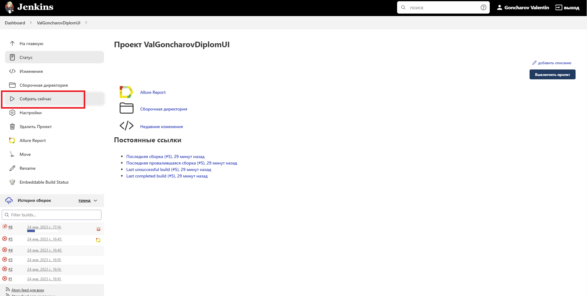
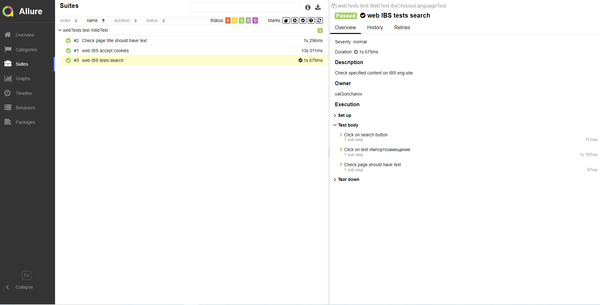
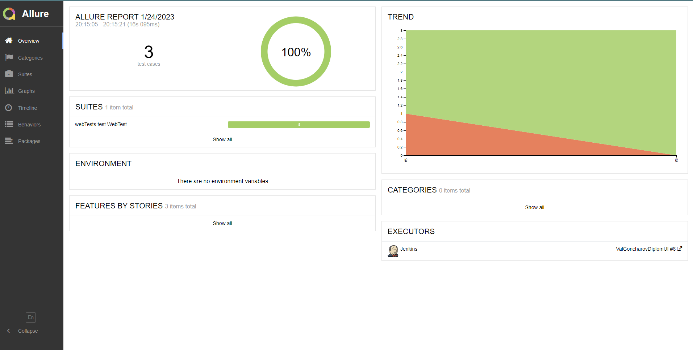
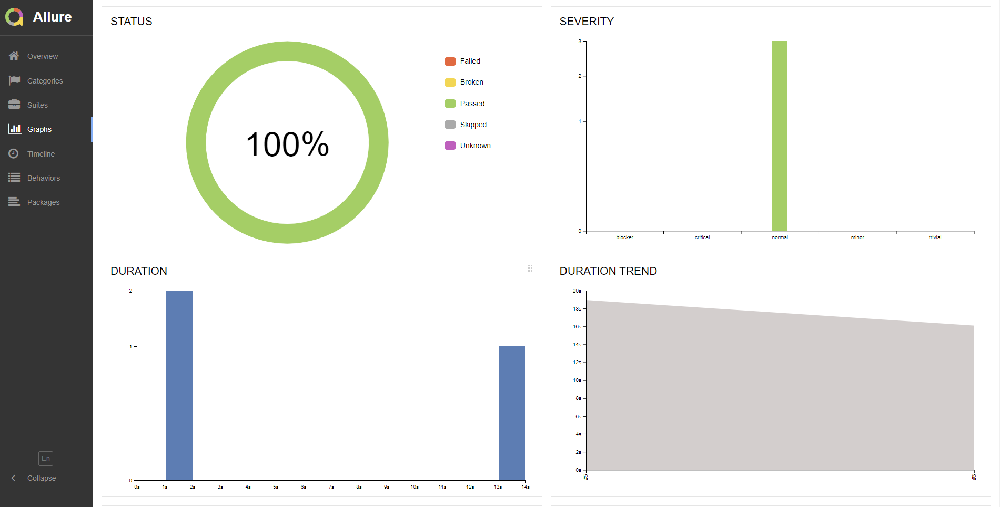

# Проект по автоматизации IBS


## 🚀: Содержание:

- [Технологии и инструменты](#earth_africa-технологии-и-инструменты)
- [Реализованные проверки](#earth_africa-Реализованные-проверки)
- [Сборка в Jenkins](#earth_africa-Jenkins-job)
- [Запуск из терминала](#earth_africa-Запуск-тестов-из-терминала)
- [Примеры использования](#earth_africa-Allure-отчет)
- [Allure отчет](#earth_africa-Allure-отчет)
- [Отчет в Telegram](#earth_africa-Уведомление-в-Telegram-при-помощи-бота)
- [Пример запуска теста в Selenoid](#earth_africa-Примеры-видео-о-прохождении-тестов)

## 🧰: Технологии и инструменты

<p align="center">
<a href="https://www.jetbrains.com/idea/"></a>
<a href="https://www.java.com/"></a>
<a href="https://github.com/"></a>
<a href="https://junit.org/junit5/"></a>
<a href="https://gradle.org/"></a>
<a href="https://selenide.org/"></a>
<a href="https://aerokube.com/selenoid/"></a>
<a href="https://github.com/allure-framework/allure2"></a>
<a href="https://www.jenkins.io/"></a>
</p>

## ⚓: Реализованные проверки

Тест 1
- ✓ Открыть русскую версию сайта ibs.ru
- ✓ Нажать на кнопку "Принять условия" (cookie)
Тест 2
- ✓ Нажать поиск
- ✓ Выбрать Импортозамещение
- ✓ Проверить что отображаются результаты

Тест 3
- ✓ Выполнить поиск компании IBS
- ✓ Проверить что в названии присутствует текст "IBS — ведущая российская IT-сервисная компания"


## </a> Jenkins <a target="_blank" href="https://jenkins.autotests.cloud/job/ValGoncharovDiplomUI/"> job </a>
<p align="center">
<a href="https://jenkins.autotests.cloud/job/ValGoncharovDiplomUI/"> </a>
</p>


## 🧙: Сборка в Jenkins:

- Browser (браузер, по умолчанию chrome)
- Version (версия браузера, по умолчанию 108.0)
- Browser_size (размер окна браузера, по умолчанию 1920x1080)


## 🏗️: Запуск тестов из терминала
Локальный запуск:
```
gradle clean test
```

Удаленный запуск:
```
clean
test
-Dbrowser=${BROWSER}
-Dversion=${VERSION}
-Dsize=${BROWSER_SIZE}
-Durl=${REMOTE_URL}
```

# Примеры использования

### Для запуска удаленных тестов необходимо заполнить remote.properties или передать значение:

* browser (default chrome)
* browserVersion (default 108.0)
* browserSize (default 1920x1080)
* remoteDriverUrl (url address from selenoid or grid)
* videoStorage (url address where you should get video)
* threads (number of threads)


Запускайте тесты с заполненным remote.properties:
```bash
gradle clean test
```

Запускайте тесты с незаполненным remote.properties:
```bash
gradle clean -DremoteDriverUrl=https://%s:%s@selenoid.autotests.cloud/wd/hub/ -DvideoStorage=https://selenoid.autotests.cloud/video/ -Dthreads=1 test
```

Выдать отчет:
```bash
allure serve build/allure-results
```
## </a> Отчет в <a target="_blank" href="https://jenkins.autotests.cloud/job/ValGoncharovDiplomUI/allure/">Allure report</a>

## 🧪: Тесты
<p align="center">

</p>

## ⛅: Основной отчет
<p align="center">

</p>

## 💹: Графики
<p align="center">

</p>

##  Пример запуска теста в Selenoid

> Видео примеры запуска тестов
<p align="center">
  
</p>
